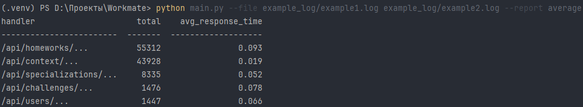
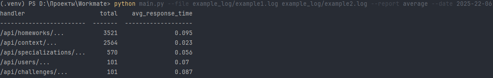
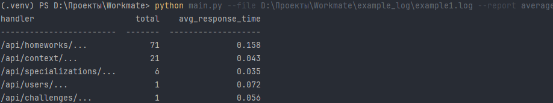

# Скрипт для обработки лог-файла.

    Установка:
1. Клонируйте репозиторий:

        git clone https://github.com/VaDKo61/LogFileProcessing

2. Установите зависимости:

        pip install -r requirements.txt

3. Запустите скрипт (пример):

        python main.py --file example_log/example1.log example_log/example2.log --report average --date 2025-22-06

   Тесты:

      Запустить test_test.py

      Или командой pytest

   
   Примеры запусков:

